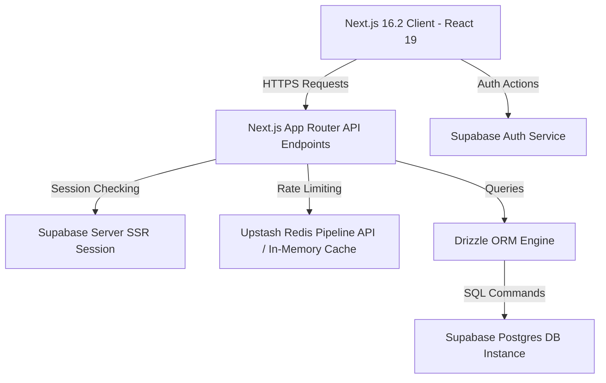
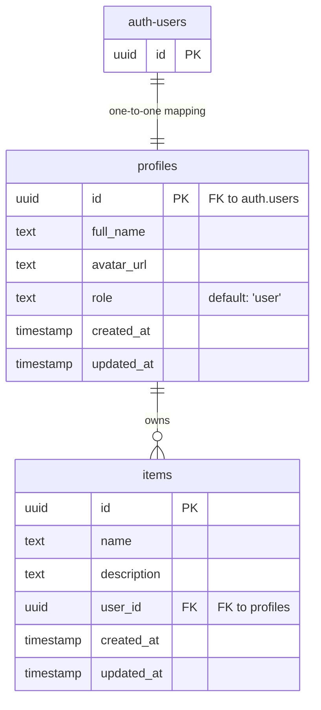

# LLM-SHEILD: COMPREHENSIVE PROJECT ARCHITECTURE & COMPLIANCE REPORT

This document represents the official detailed project report for **LLM-SHEILD**, a secure, real-time database operations vault and AI compliance auditing system. It covers the system's vision, database schema models, architectural structure, API endpoints, backend security protocols, frontend styling details, and deployment rules.

---

## 1. Executive Summary & Project Vision

### 1.1 Project Overview
**LLM-SHEILD** is a state-of-the-art secure database vault designed to manage, audit, and secure encrypted records. The system acts as a secure operations console to guarantee compliance, traceability, and prevention of data leaks. By structuring data access through strict role-based control and comprehensive logging, LLM-SHEILD ensures database compliance is maintained at all times.

### 1.2 Target Problems Addressed
*   **Sensitive Data Leakage**: Preventing unauthorized database operations by staging and auditing record creation through a secure interface.
*   **Audit Non-Compliance**: Lack of a centralized audit trail detailing who created or modified database records.
*   **Insecure Session Storage**: Guarding user state using secure server-side cookies (via Supabase SSR) to defend against cross-site scripting (XSS) and session hijack attacks.
*   **API Exhaustion**: Applying robust rate limiting to protect operational API endpoints from denial-of-service (DoS) or database scraping.

---

## 2. Technical Stack & Architectural Layers

LLM-SHEILD is built as a full-stack, type-safe application utilizing modern frameworks and paradigms:



### 2.1 Frontend Framework & Runtime
*   **Next.js 16.2.10 (App Router)**: Handles client rendering, layout definitions, and backend API routing under the Turbopack engine.
*   **React 19.2.4**: Powers the frontend component tree, utilizing modern hook states and Suspense loaders.
*   **Tailwind CSS v4.0.0**: Handles styling via CSS theme variable configurations, providing standard compilation and design token resolution.

### 2.2 Database & Object Relational Mapper (ORM)
*   **Supabase PostgreSQL**: A cloud-hosted PostgreSQL database acting as the primary transactional storage engine.
*   **Drizzle ORM v0.45.2**: Provides type-safe SQL query generation, schema declaration, and migrations management.

### 2.3 Authentication & Session Management
*   **Supabase SSR v0.12.3**: Handles cookie-based authentication, bridging authentication state seamlessly between Server Components, Route Handlers, and Client Components.

### 2.4 Testing Engine
*   **Vitest v4.1.10**: Performs fast, concurrent unit testing on backend guards, rate limits, and configuration files.
*   **Playwright v1.61.1**: Drives end-to-end (E2E) browser automation tests simulating user login, item CRUD operations, and administrator access checks.

---

## 3. Database Schema & Data Models

The database comprises two primary schemas: Drizzle's public catalog representing business models and Supabase's internal auth catalog representing authentication records.

### 3.1 Relational Diagram



### 3.2 Schema Declarations

#### 3.2.1 Profiles Table (`db/schema/profiles.ts`)
Creates a mirror table to catch user registration updates triggered from Supabase's base Auth layer:
*   `id`: Primary Key (`uuid`), references `auth.users.id` with a `cascade` deletion constraint.
*   `fullName`: Text representation of user's display name.
*   `avatarUrl`: Text storage of user profile images.
*   `role`: Not-null text string specifying permission levels. Must resolve to `'user'` (base operator) or `'admin'` (systems administrator). Defaults to `'user'`.
*   `createdAt` & `updatedAt`: Automatic timestamps with time zone.

#### 3.2.2 Items Table (`db/schema/items.ts`)
Represents the protected items repository details:
*   `id`: Primary Key (`uuid`), automatically generated via `defaultRandom()`.
*   `name`: Not-null text string representing the record tag or database object name.
*   `description`: Nullable text payload representing context metadata.
*   `userId`: Not-null reference (`uuid`) linking the record to a profile owner in the `profiles` table. Deleting a profile automatically cascades to purge their items.
*   `createdAt` & `updatedAt`: Auto-generated timestamps tracking creation and updates.

---

## 4. API Endpoints Catalog

The system features structured endpoints implementing RESTful operations for record management and auditing:

### 4.1 `/api/auth/callback` (Auth Callback Handler)
*   **Method**: `GET`
*   **Purpose**: Callback endpoint targeted during OAuth operations (Google, GitHub). Converts exchange tokens to local session cookies and redirects the user to the home panel.

### 4.2 `/api/v1/items` (Protected Items Root)
*   **Method**: `GET`
    *   **Access**: Authenticated User.
    *   **Behavior**: Fetches all secure items owned by the requesting user.
*   **Method**: `POST`
    *   **Access**: Authenticated User.
    *   **Payload**: `{ name: string, description: string }`
    *   **Behavior**: Validates data inputs, rate-limits user submission, generates new record entry, and binds ownership to current operator.

### 4.3 `/api/v1/items/[id]` (Resource Actions)
*   **Method**: `PATCH`
    *   **Access**: Authenticated User (Owner or Admin).
    *   **Payload**: `{ name?: string, description?: string }`
    *   **Behavior**: Updates target item attributes.
*   **Method**: `DELETE`
    *   **Access**: Authenticated User (Owner or Admin).
    *   **Behavior**: Deletes record from table.

### 4.4 `/api/dashboard/admin/items` (Systems Audit)
*   **Method**: `GET`
    *   **Access**: Authenticated Systems Administrator.
    *   **Behavior**: Fetches all items stored across all database partitions, joined with owner names and roles for global metadata auditing. Returns `403 Forbidden` if accessed by non-admins.

### 4.5 `/api/health` (Health Probe)
*   **Method**: `GET`
    *   **Purpose**: Basic endpoint for load-balancers or container engines to confirm system availability.

---

## 5. Security Protocols & Operational Middleware

LLM-SHEILD enforces layers of backend security policies to defend API targets against abuse and bypasses.

### 5.1 Authentication Guard Layer (`lib/auth/guards.ts`)
*   `requireAuth()`: Confirms presence of a valid Supabase SSR session token. Throws an `AuthError(401, "Unauthorized")` if absent.
*   `requireAdmin()`: Performs an auth check, then retrieves user metadata or profile table status to confirm admin role membership. Throws an `AuthError(403, "Forbidden")` if roles mismatch.
*   `requireOwnership(resourceOwnerId)`: Intercepts mutations. Compares the current operator's id against the resource owner's ID. Allows action if they match or if the user is an admin. Throws an `AuthError(403, "Forbidden")` otherwise.

### 5.2 Rate Limiting Middleware (`lib/rate-limit.ts`)
*   Protects endpoints by checking client IP or User ID against an active rate quota (Defaults to 60 requests per minute).
*   **Upstash Redis Integration**: Uses an HTTP POST pipeline connection to increment cache counters in Upstash Redis, allowing centralized rate limits in clustered environments.
*   **In-Memory Fallback**: If Upstash keys are absent (local development), switches to an in-memory javascript Map tracker, automatically clearing expired entries.
*   **Fail-Open Pattern**: Designed to log errors and allow traffic in the event of rate-limiting service timeouts or connection failures.

---

## 6. Frontend Redesign & Design System

The application layout has been refactored under the **Exaggerated Minimalism (Operations Console)** design system.

### 6.1 Custom CSS Themes (`app/globals.css`)
*   **Fonts Imported**: Google Fonts `Fira Code` (for precise, mono-spaced tags, UUID fields, and table contents) and `Fira Sans` (for readable description lines).
*   **Visual Texture**: Added linear-gradient scanline overlays (`.scanlines`) and moving laser cards (`.scanner-bar`) running in keyframes to create a military-grade security console feel.
*   **Design Tokens Applied**:
    ```css
    @theme {
      --font-sans: "Fira Sans", sans-serif;
      --font-mono: "Fira Code", monospace;

      --color-primary: #00FF41;      /* Matrix Green */
      --color-accent: #FF3333;       /* Alert Red */
      --color-background: #000000;   /* Pure Black */
      --color-secondary: #0D0D0D;    /* Sidebar Slate */
      --color-foreground: #E0E0E0;   /* Cyber Grey */
      --color-border: #1F1F1F;       /* Frame Steel */
    }
    ```

### 6.2 UI Components Reworked

#### 6.2.1 Navigation & Layout Client (`components/dashboard-layout.tsx`)
*   Reworked sidebar panel styling to support operations desk specs.
*   Integrated a live pulsing status indicator tracking client-side connectivity (`SYSTEM STATUS: SECURE`).
*   Configured user badges to render color-coded roles (`ROLE: ADMIN` in neon red; `ROLE: USER` in neon green).
*   Styled navigation links with custom border box tabs (`[ Dashboard ]`, `[ Admin Panel ]`).

#### 6.2.2 Dashboard Home (`app/(dashboard)/page.tsx`)
*   Redesigned records feed into `.cyber-panel` styled blocks featuring UUID header prefixes, glowing indicator pins, and monospaced action triggers (`[ EDIT ]`, `[ PURGE ]`).
*   Created a customized secure modal containing monospace text inputs, dark panel backdrops, and glowing green save parameters (`[ COMMIT_WRITE ]`).

#### 6.2.3 Admin Security Audit Spreadsheet (`app/(dashboard)/admin/page.tsx`)
*   Designed the admin panel compliance logs list as an operational terminal grid.
*   Divided database rows with thin steel borders, highlighting owner profiles, timestamp arrays, and permission levels.

#### 6.2.4 Auth Panels (`login`, `signup`, `reset-password`)
*   Transformed generic gradient login layouts into centralized operator authorization desks.
*   Configured inputs as dark, zero-radius fields, and styled validation errors and success prompts as terminal-style output logs.

---

## 7. Setup & Run Instructions

### 7.1 Environment Configuration (`.env.local`)
Create a `.env.local` file containing the following variables:
```bash
# Supabase Database Credentials
NEXT_PUBLIC_SUPABASE_URL="https://your-supabase-project.supabase.co"
NEXT_PUBLIC_SUPABASE_ANON_KEY="your-anon-key"
SUPABASE_SERVICE_ROLE_KEY="your-service-role-key"

# Upstash Redis Configuration (Optional Rate Limiter, falls back to local memory if absent)
UPSTASH_REDIS_REST_URL="https://your-upstash.upstash.io"
UPSTASH_REDIS_REST_TOKEN="your-token"
```

### 7.2 Running Development Server
Install npm dependencies and launch the dev environment:
```bash
npm install
npm run dev
```
Open [http://localhost:3000](http://localhost:3000) to view the operations panel.

### 7.3 Verifying CSS & Building for Production
Verify typescript bindings and compile output:
```bash
# Verify TypeScript compile
npm run typecheck

# Compile production bundle
npm run build
```

---

## 8. Recommended Roadmap Enhancements

To further enhance LLM-SHEILD, we propose implementing the following roadmap options:

1.  **PII & Prompt Injection Playground (LLM Defense)**:
    *   Integrate a sandbox area allowing operators to draft prompts.
    *   Apply regular expression filters and AI-native checks to scan inputs, highlight security threats, and redact personal identifiers (emails, phones) automatically before they leave the environment.
2.  **Visual Analytics dashboard**:
    *   Implement SVG metrics charts plotting total requests, threat warnings, and security audits over time.
3.  **Local Web Crypto Cryptographic Encryption**:
    *   Leverage client-side AES-GCM (Web Crypto API) to encrypt record payloads in-browser, ensuring only operators with the correct client passphrase can decrypt sensitive values, maintaining zero-knowledge storage in Supabase.
4.  **Audit Logs Filters & Exporters**:
    *   Extend the admin console table to filter by date ranges, user tags, and metadata keyword search.
    *   Provide CSV/JSON download triggers for security compliance logging.
